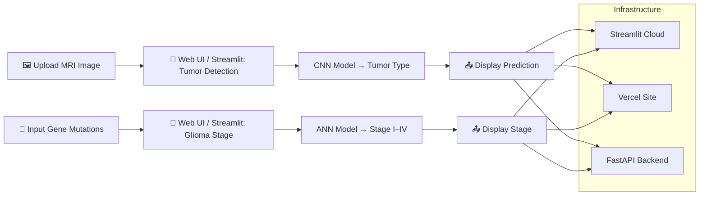

# 🧠 NeuroAssist AI

**Advanced Brain Tumor Detection & Glioma Stages Prediction**

🚀 **[👉 Main Site](https://neuroassistai.vercel.app/)**  
🌐 **[Try it on Streamlit](https://neuroassist.streamlit.app/)**  
⚡ **[FastAPI Backend](https://neuroassist-api.onrender.com/docs)**

---

## 📑 Contents

1. [Overview](#overview)
2. [End-to-End Pipeline](#end-to-end-pipeline)
3. [Why NeuroAssistAI?](#why-neuroassistai)
4. [Research Basis](#research-basis)
5. [Dataset](#dataset)
6. [Model Architectures](#model-architectures)
7. [Download Pretrained Models](#download-pretrained-models)
8. [Tech Stack](#tech-stack)
9. [Project Structure](#project-structure)
10. [Installation & Local Run](#installation--local-run)
11. [API Endpoints](#api-endpoints)
12. [Embedding](#embedding)
13. [Contributing](#contributing)
14. [License](#license)
15. [Contact](#contact)

---

## Overview

**NeuroAssist AI** is a full‑stack AI‑powered diagnostic pipeline that brings brain tumor analysis to your browser, combining deep learning models with a modern web interface.

The system operates in two stages:

1. **Tumor Type Detection**
   A custom **CNN** classifies grayscale MRI scans into
   `Glioma`, `Meningioma`, `Pituitary` or `No Tumor`.

2. **Glioma Stage Prediction**
   A compact **ANN** predicts glioma stage (I–IV) from gene‑mutation inputs.

Built in **PyTorch**, served via **Streamlit** (interactive demo) and **FastAPI** (production API), with a **Next.js** frontend for a complete end‑to‑end user experience.

---

## End‑to‑End Pipeline



---

## Why NeuroAssistAI?

* **Clinically Inspired**: Mirrors real diagnostic workflows.
* **Zero‑Install**: Models auto‑download from Google Drive at first run.
* **Triple Deployment**:
  * Interactive demo on **Streamlit**
  * Full web app on **Vercel** (Next.js)
  * Production API via **FastAPI**
* **Extensible**: Easy to swap models or front‑ends.

---

## Research Basis

Inspired by the study

> "Brain Tumor Classification and Glioma Stage Prediction Using Deep Learning"
> implemented from scratch with public MRI datasets and gene mutation data.

---

## Dataset

* **Source**: [Kaggle Brain Tumor Dataset](https://www.kaggle.com/datasets)
* **Classes**: `Glioma`, `Meningioma`, `Pituitary`, `No Tumor`
* **Format**: Grayscale `.jpg` in class‑named folders

---

## Model Architectures

### 🔷 CNN – Tumor Type Detection

| Layer         | Details                                        |
| ------------- | ---------------------------------------------- |
| **Input**     | 1×224×224 grayscale MRI                        |
| Conv Block ×3 | Conv2D → ReLU → MaxPool2D                      |
| FC Layers     | Flatten → Dense(512) → Dense(256) → Softmax(4) |
| **Output**    | 4‑class probability                            |

### 🟢 ANN – Glioma Stage Classification

| Layer        | Details                                 |
| ------------ | --------------------------------------- |
| **Input**    | 9 numerical features (gene mutations)   |
| Dense Layers | 100 → 50 → 30 neurons, ReLU activations |
| **Output**   | Softmax(4) → Stage I–IV                 |

---

## Download Pretrained Models

Due to GitHub's 100 MB limit, download the models externally:

* **TumorClassification (CNN)**
  [Download BTD_model.pth](https://drive.google.com/uc?export=download&id=1juQk4AhIi7u7I41uttCUpJYsvtsPyZUy)
* **GliomaStageModel (ANN)**
  [Download glioma_stages.pth](https://drive.google.com/uc?export=download&id=19MrhHVQbSlVmaV-bP_FIpcY5t9wjKMSX)

After downloading, place them in:

```
model/              → for the Streamlit demo
web/backend/models/ → for the FastAPI backend
```

> *Tip:* The apps will auto‑fetch these if missing.

---

## Tech Stack

| Category         | Tools / Libraries                                    |
| ---------------- | ---------------------------------------------------- |
| Language         | Python 3.10+, TypeScript                             |
| Deep Learning    | PyTorch, torchvision                                 |
| Backend API      | FastAPI, Uvicorn, Pydantic                           |
| Frontend         | Next.js 15, React 19, Tailwind CSS, shadcn/ui       |
| Model Demo       | Streamlit                                            |
| Data Science     | Pillow, NumPy                                        |
| Hosting          | Vercel, Streamlit Community Cloud, Render            |
| Model Storage    | Google Drive (public download links)                 |

---

## Project Structure

```
NeuroAssist-Ai/
│
├── web/                            # Next.js web application
│   ├── app/                        # App Router pages & API mock routes
│   │   ├── detect-tumor/           #  MRI upload & tumor detection page
│   │   ├── predict-glioma/         #  Gene mutation input & staging page
│   │   ├── screening/              #  Initial health screening
│   │   ├── diagnostic/             #  Full diagnostic report
│   │   ├── complete-analysis/      #  Combined analysis view
│   │   ├── services/               #  Services overview
│   │   ├── about/                  #  About the project & team
│   │   ├── contact/                #  Contact page
│   │   └── api/mock/               #  Mock API endpoints for development
│   ├── components/                 # React components (shadcn/ui)
│   │   ├── ui/                     #  UI primitives (button, card, dialog, etc.)
│   │   └── ai-assistant/           #  AI chat assistant components
│   ├── backend/                    # FastAPI inference API
│   │   ├── main.py                 #  Model loading & prediction logic
│   │   ├── index.py                #  FastAPI REST endpoints
│   │   ├── models/                 #  PyTorch model definitions
│   │   │   ├── __init__.py
│   │   │   └── TumorModel.py       #  CNN & ANN architectures
│   │   ├── utils.py                #  Helper functions & precautions
│   │   ├── requirements.txt        #  Python dependencies
│   │   └── start_server.py         #  Startup script with dependency checks
│   ├── lib/                        # API client & utilities
│   ├── public/                     # Static assets & team photos
│   ├── styles/                     # Global CSS
│   ├── package.json
│   ├── next.config.mjs
│   ├── tailwind.config.ts
│   └── tsconfig.json
│
├── model/                          # Standalone Streamlit ML demo
│   ├── app.py                      # Streamlit UI (tumor detection + staging)
│   ├── TumorModel.py               # CNN & ANN model definitions
│   ├── requirements.txt            # Python dependencies
│   └── README.md                   # Model-specific documentation
│
├── README.md                       # You are here
├── .gitignore
└── LICENSE
```

---

## Installation & Local Run

### Run the Streamlit model demo

```bash
cd model
python -m venv .venv
source .venv/bin/activate    # macOS/Linux
.venv\Scripts\activate       # Windows
pip install -r requirements.txt
streamlit run app.py
```

### Run the FastAPI backend

```bash
cd web/backend
python -m venv .venv
source .venv/bin/activate
.venv\Scripts\activate
pip install -r requirements.txt
python start_server.py
# or: uvicorn index:app --host 0.0.0.0 --port 8000 --reload
```

### Run the Next.js frontend

```bash
cd web
npm install
npm run dev
```

The app will be available at `http://localhost:3000`. Set `NEXT_PUBLIC_API_URL` in `.env.local` to point to your backend.

---

## API Endpoints

The FastAPI backend provides the following endpoints:

| Endpoint | Method | Description |
|----------|--------|-------------|
| `/` | GET | Health check & model status |
| `/predict-image` | POST | Upload MRI image for tumor classification |
| `/predict-glioma-stage` | POST | Submit mutation data for glioma staging (gender, age, idh1, tp53, atrx, pten, egfr, cic, pik3ca) |
| `/test` | GET | Debug endpoint with system info |

### Example: Predict tumor from MRI

```bash
curl -X POST https://neuroassist-api.onrender.com/predict-image \
  -F "file=@brain_scan.jpg"
```

### Example: Predict glioma stage

```bash
curl -X POST https://neuroassist-api.onrender.com/predict-glioma-stage \
  -H "Content-Type: application/json" \
  -d '{"gender":"m","age":55,"idh1":1,"tp53":1,"atrx":1,"pten":0,"egfr":1,"cic":0,"pik3ca":1}'
```

---

## Embedding

Embed the Streamlit demo in your site via:

```html
<iframe
  src="https://neuroassist.streamlit.app/"
  width="100%" height="800" frameborder="0"
  aria-label="NeuroAssistAI Models">
</iframe>
```

Or embed the full web app:

```html
<iframe
  src="https://neuroassistai.vercel.app/"
  width="100%" height="800" frameborder="0"
  aria-label="NeuroAssistAI Web App">
</iframe>
```

---

## Contributing

1. Fork & clone
2. Create a branch: `git checkout -b feat/YourFeature`
3. Commit & push: `git commit -m "Add YourFeature"`
4. Open a Pull Request

---

## License

This project is licensed under **MIT**. See [LICENSE](LICENSE) for details.

---

## 📬 Contact

Feel free to reach out or connect with me:

- 📸 [Instagram](https://www.instagram.com/codewithsalty/)
- 💼 [LinkedIn](https://www.linkedin.com/in/s4lmankhan/)
- 🐙 [GitHub](https://github.com/codewithsalty)
- 📧 [Email Me](mailto:codewithsalty@gmail.com)
